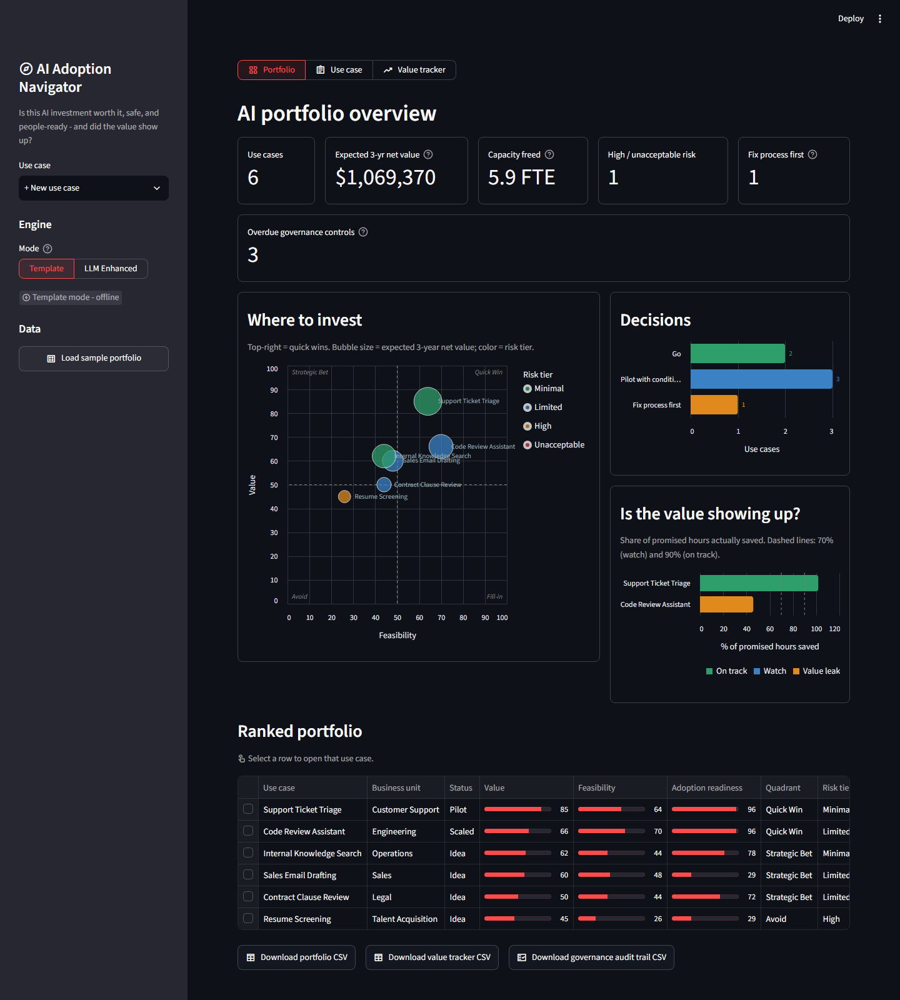
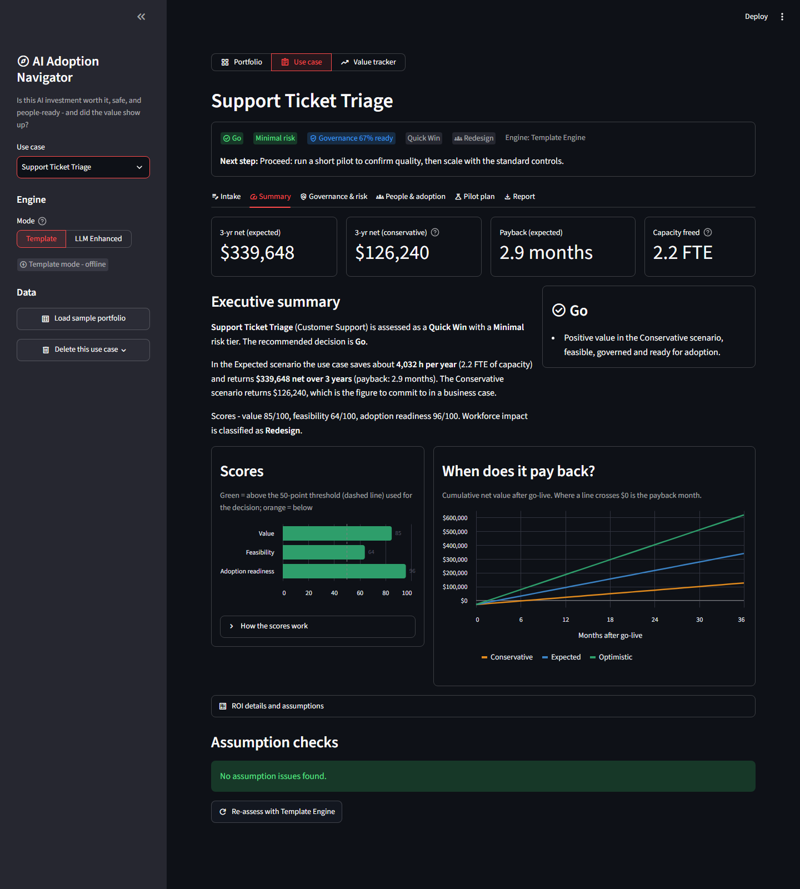
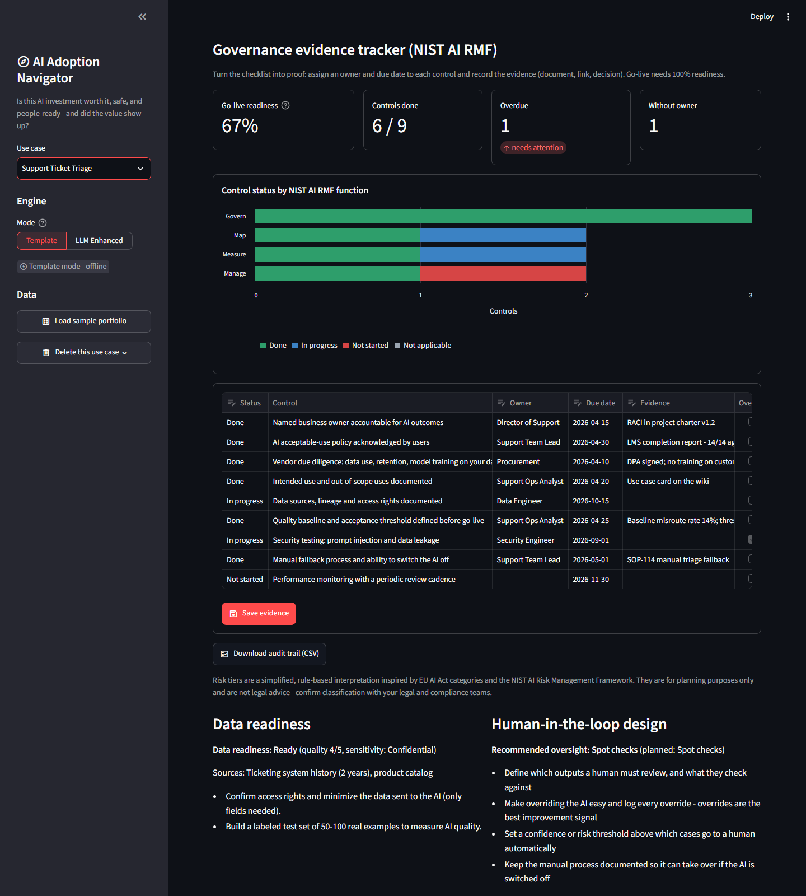
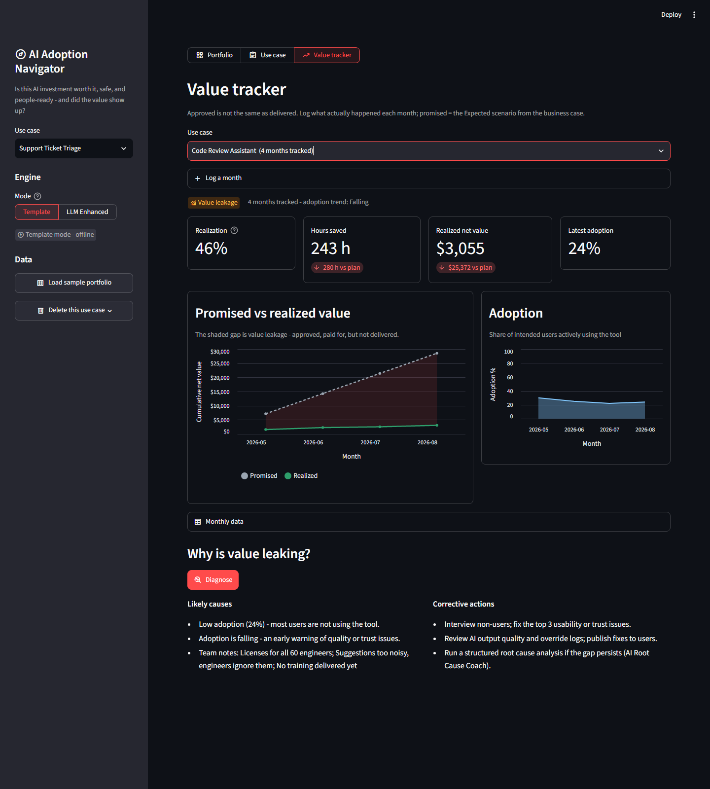
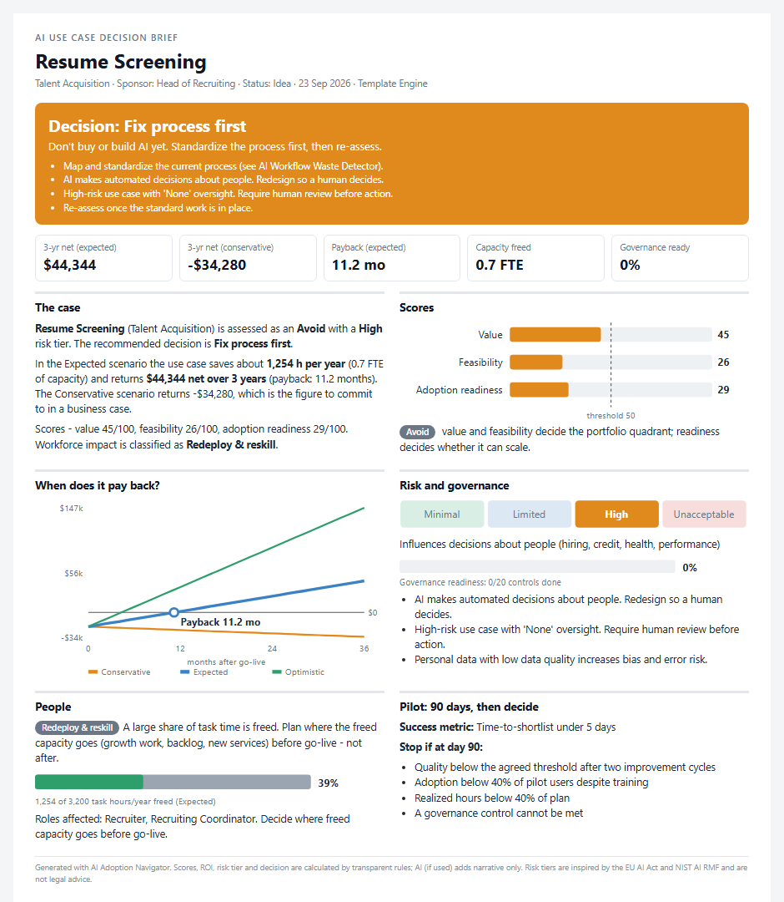

# AI Adoption Value & Governance Navigator

[](https://github.com/Sviless/ai-adoption-navigator/actions/workflows/tests.yml)


[](LICENSE)

> Is this AI investment worth it, is it safe, what happens to the people involved, and did the promised value actually show up?

Many companies buy AI tools without a measurable business case, without governance, and without a plan for the people whose work changes. The **AI Adoption Navigator** is a local-first Streamlit app that makes AI adoption **measurable, governed and people-centered**, from the first idea to proven value.

It is part of a portfolio of AI-enabled operational excellence tools (AI Project Manager Assistant, Knowledge Transfer & SOP Builder, Savings Impact Analyzer, Workflow Waste Detector, Root Cause Coach, Resource Capacity Planner).



## Screenshots

| Use case summary: decision, payback and scores | Governance evidence tracker (NIST AI RMF) |
|---|---|
|  |  |
| **Value tracker: promised vs realized value** | **One-page executive decision brief** |
|  |  |

*All screenshots use the built-in generic sample data.*

## What it does

The app has three views: **Portfolio**, **Use case** and **Value tracker**.

**Portfolio** is the leadership view:
- KPIs for the whole portfolio.
- A *Where to invest* value vs feasibility matrix (bubble = 3-yr value, color = risk tier).
- A *Decisions* chart.
- An *Is the value showing up?* realization chart.
- A ranked table with governance readiness. Click a row to open that use case.
- Downloads: portfolio CSV, value tracker CSV and a governance audit trail covering every use case.

**Use case** starts with a verdict banner (decision, risk tier, governance readiness, quadrant, workforce impact) and a plain-language **next step**, followed by these tabs:

| Tab | Output | Chart |
|---|---|---|
| **Intake** | Structured AI use case. *Smart intake* pre-fills the form from a pasted idea, email or vendor pitch | - |
| **Summary** | Value, feasibility and adoption readiness scores; 3-scenario ROI; assumption checks; decision: **Go / Pilot with conditions / Fix process first / Stop** | Score bars vs threshold; *When does it pay back?* cumulative cash flow |
| **Governance & risk** | EU AI Act-inspired risk tier, red flags, and a **governance evidence tracker**: every NIST AI RMF control gets a status, owner, due date and evidence. Includes go-live readiness %, overdue detection and an audit trail CSV. Also data readiness and human-in-the-loop design | Risk tier ladder; control status by NIST function |
| **People & adoption** | Workforce impact (Augment / Redesign / Redeploy & reskill), skills, capacity plan, ADKAR change plan, stakeholder communication | *Where the time goes*: hours freed vs work that remains |
| **Pilot plan** | 30/60/90-day pilot with exit and **stop criteria**, risk log | Pilot timeline with decision point |
| **Report** | **One-page executive decision brief** (standalone HTML; use Print > Save as PDF), full Markdown report including governance evidence, and an achievement statement | Brief includes payback, scores, risk tier, governance readiness and time-freed charts |

**Value tracker** covers the monthly results:
- Actual results vs the promised value.
- **Value leakage** detection and the adoption trend.
- A *Promised vs realized value* chart, where the shaded area is the leakage.
- A diagnosis of why the value isn't showing up.

### Design principles
- **Numbers are calculated locally, and AI is used for judgment.** Scores, ROI, risk tier and decision gate are rule-based and reproducible. The LLM adds insight and narrative but never changes the numbers.
- **Fix the process before automating it.** A non-standardized process gets "Fix process first", because otherwise AI scales today's waste.
- **Conservative by default.** Business cases commit to the Conservative scenario, which pushes back against inflated vendor promises.
- **Plan for people before go-live.** Freed capacity needs a destination, and employees need to be involved in the design.
- **Prove it.** Approved is not the same as delivered. The value tracker shows whether the promised value showed up.

## Two modes

| | Template Engine Mode | LLM Enhanced Mode |
|---|---|---|
| Needs | Nothing - fully offline | API key for Claude, OpenAI, Gemini or Groq, **or** a local Ollama model (no key) |
| Scores, ROI, tier, gate | Rule-based | Same (identical numbers) |
| Smart intake | Keyword rules | Reads the text with real understanding |
| Extra insights | Rule-based assumption checks | Skeptical-CFO assumption challenges, tier rationale, key controls, tailored workforce, adoption and pilot advice, extra risks |
| Value gap diagnosis | Rule-based causes and actions | Root-cause style diagnosis plus sponsor summary |

If an LLM call fails (bad key, rate limit, invalid response), the app falls back to Template Engine output and shows a warning.

## Quick start

```bash
pip install -r requirements.txt
python -m streamlit run app.py
```

Click **Load sample portfolio** in the sidebar to explore six generic use cases, including a deliberately High-risk resume-screening example and a use case that is leaking value.

For LLM Enhanced Mode, see [LLM_SETUP_GUIDE.md](LLM_SETUP_GUIDE.md).

## Project structure

```
app.py                     Streamlit UI (Portfolio / Use case / Value tracker views)
src/
  scoring.py               Value, feasibility, adoption readiness, quadrant, decision gate, workforce impact
  roi.py                   3-scenario ROI, payback, realized-vs-promised value
  governance.py            Risk tier rules, NIST AI RMF checklist, red flags, evidence readiness
  template_engine.py       All report sections, assumption checks, smart intake rules, value gap rules
  providers/               base / template / enhanced_llm providers (template first, LLM enhances, fallback)
  llm_client.py            Claude, OpenAI, Gemini, Groq and local Ollama
  config.py                Mode and provider settings (API keys kept in memory only)
  db.py                    SQLite: use cases, saved assessments, monthly actuals, governance evidence
  exporters.py             Markdown report, CSV and audit trail exports
  brief.py                 One-page executive decision brief (HTML + inline SVG charts)
  visualizations.py        Altair charts
  validators.py            Required fields and sanitizing of AI-suggested fields
  sample_data.py           Six generic sample use cases with monthly actuals
tests/                     Unit tests + headless UI smoke tests
docs/images/               README screenshots (generic sample data)
.github/workflows/         CI: runs the full test suite on every push
```

## Tests

```bash
python -m unittest discover -s tests -t .
```

48 tests cover ROI math against hand calculations, risk tiers, checklist rules, governance readiness and evidence storage, executive brief content and HTML escaping, scoring bounds, decision gates, report wording, cash-flow and payback consistency, the LLM merge and fallback logic (with a fake LLM), and headless UI runs of every view and sample use case.

## Tech stack
Python, Streamlit, SQLite, pandas, Altair, optional LLM SDKs (Anthropic, OpenAI, Google, Groq) or Ollama. Built with VS Code, GitHub Copilot and Claude.

## Author

**Gustavo Angulo** ([@Sviless](https://github.com/Sviless)) works in project management, Lean / operational excellence, and practical AI adoption.

This project is part of a series of AI tools that apply PM and Lean methods (standard work, root cause analysis, waste elimination, value realization) to real business problems.

## License

[MIT](LICENSE)

## Disclaimer
Risk tiers are a simplified, rule-based interpretation inspired by the EU AI Act and NIST AI RMF, for planning and educational purposes only. They are not legal advice.
